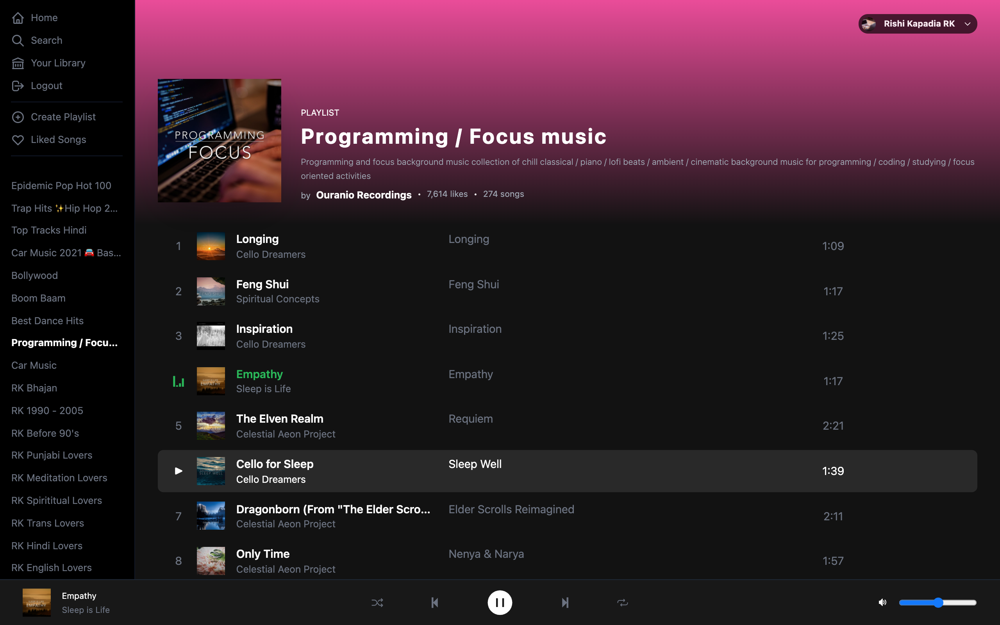

# Screenshots
## Spotify Clone : Login Page

## Spotify Clone : Dashboard


# Requirements
1. **Spotify** Developer Account
2. **Spotify** Demo App Created On **Spotify** Developer Account
3. **Spotify** Premium Account

## Step 1 : `Install Node Modules`
```bash 
yarn
```

## Step 2 : `Create Enviroment File`
Rename `env.example` to `.env` and replace your value with enviroment variables

## Step 3 : `Run Project`
```bash 
yarn dev
```

Done